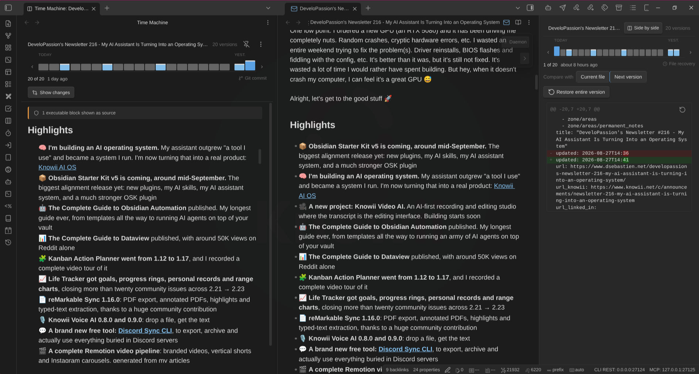

# Usage

## Opening the view

Open the command palette (`Ctrl/Cmd + P`) and run **Time Machine: Open view**. The Time Machine panel opens in the right sidebar.

The panel automatically displays snapshots for whichever file is currently active. When you switch to a different file, the view updates automatically.

For the fuller experience, run **Time Machine: Compare versions side by side** (or click the two-columns icon in the ribbon) to open a note's history beside the editor -- see [The past view](#the-past-view) below.

## The past view



The sidebar is the quick look. The past view is the full one: it opens your note **as it was**, in a pane beside the editor, so you can read an old version on the left while your real, editable note stays on the right. Drag the divider to resize.

Open it with the command **Time Machine: Compare versions side by side**, the two-columns icon in the ribbon, a right-click on a note in the file explorer or inside the editor, or the **Side by side** button in the panel's header (which carries your current selection across).

On mobile, or when the window is too narrow to split usefully, it opens as a full-width tab instead.

Once open:

- **Click a version** on the rail at the top. Every version gets its own mark -- none are merged away -- grouped under headings like Today, 7 days, 30 days and then by year. Hovering a mark tells you exactly which version it is, and clicking a heading jumps to the newest version in that group.
- **Keyboard**: focus the rail, then arrow left/right to step one version, PageUp/PageDown to move ten at a time, Home for the newest and End for the oldest.
- **Show changes** flips the pane between the old version and the diff.
- **Follow / bind** (the pin button) decides whether the pane follows whatever note you open, or stays on one. It follows by default, like the sidebar panel — click the pin to hold it on the current note.
- **The menu** (⋮) restores the whole version, copies it, or saves it as a new note beside the original.

### Old versions do not run their code

If a version contains a `dataviewjs` or `dataview` block, Time Machine shows it as plain text rather than running it, and tells you how many blocks it skipped.

This is deliberate. Rendering an old version would otherwise execute that code against your vault **as it is today** -- including code you deleted from the note precisely because you did not want it running. If you would rather see those blocks live, turn on **Run code in old versions** in settings.

## Commands

| Command                                                         | Description                                                                                    |
| --------------------------------------------------------------- | ---------------------------------------------------------------------------------------------- |
| **Time Machine: Open view**                                     | Opens the Time Machine panel in the sidebar                                                    |
| **Time Machine: Compare versions side by side**                 | Opens the side-by-side view for the current note, beside the editor                            |
| **Time Machine: Force File Recovery snapshot for current file** | Immediately creates a File Recovery snapshot for the active file, bypassing the interval timer |
| **Time Machine: Export version history to Markdown**            | Saves recorded history as a separate Markdown note beside the current note                     |
| **Time Machine: Freeze version history into current note**      | Inserts or replaces a static history section in the current note, after confirmation           |

Only markdown notes have a history, so **Compare versions side by side** does not appear unless a markdown note is active. It is also hidden entirely when the side-by-side view is turned off in settings.

### Other ways in

Besides the command palette, the side-by-side view can be opened from:

- The **ribbon icon** (two columns) in the left ribbon
- **Right-clicking a note** in the file explorer, or right-clicking inside the editor
- The **Side by side** button in the Time Machine panel's header, which carries your current selection across so you do not lose your place

The ribbon icon disappears when the side-by-side view is disabled in settings.

## Saving history as Markdown

Both history commands work on the current Markdown note, independently of whether the
side-by-side view is enabled. They produce plain Markdown that remains readable without
Time Machine, syncs as text, and can be published or committed to Git.

### Export to a separate note

1. Open the note whose history you want to save.
2. Run **Time Machine: Export version history to Markdown** from the command palette.
3. Choose **Content**: **Changes between versions** (default) or **Full versions**.
4. Set **Maximum versions** to a positive whole number, or leave it as **all**.
5. Select **Export**.

The export appears beside your note as `My note (history).md`. If that name is taken,
Time Machine uses `My note (history) 2.md`, then the next free numeric suffix. Existing
files and the source note are never overwritten. Repeating an export creates a new file.

### Freeze history inside the source note

1. Run **Time Machine: Freeze version history into current note**.
2. Choose the content format and version limit. The default is the **latest 20** unique
   recorded versions; use **all** to include every available version.
3. Select **Continue**, then review the note path, version count and output size.
4. Select **Freeze history** to confirm, or **Cancel** to leave the note unchanged.

This adds a static **Version history** section at the end of your note. Repeating the
command replaces the generated section in place rather than appending another one.
Text outside that section is preserved, including a manually written heading with the same
name. Edits **inside** the generated section are replaced next time.

Time Machine identifies its section using standalone comment markers:

```text
<!-- time-machine:history:start -->
## Version history
...
<!-- time-machine:history:end -->
```

Keep both markers intact. A missing, reversed or duplicate marker stops the operation without
writing; repair the markers before trying again. Marker examples inside code fences are
not treated as generated sections. Close unfinished code fences, raw HTML blocks and
frontmatter before inserting history.
If you edit or rename the note while history is being prepared or confirmed, freezing stops:
run the command again against the updated note.

Freezing is an intentional note edit and can create a File Recovery snapshot. Previously
generated history is removed from snapshot content **before** deduplication and export, so
the section cannot recursively contain older copies of itself. It does not update automatically.

### What the output contains

- Entries are newest-first, with UTC timestamps and their source. Git entries include the
  author, full commit hash and commit message's first line. File Recovery does not record an
  author; the output says so explicitly.
- **Changes between versions** shows each version's changes from the next older included
  version, with three context lines. The oldest included version is a baseline from an empty
  note. The sidebar's **Compare with** setting does not affect exports.
- **Full versions** includes each version's Markdown source in a code block. Historical code,
  embeds and queries are displayed as source, not executed or resolved against today's vault.
- Duplicate content is removed, keeping the newest snapshot. Unlike the timeline, exports
  **include** recorded versions that match the current note. Unsnapshotted current edits
  are not added; use **Force File Recovery snapshot for current file** first if needed.
- Line endings in exported history are normalized to LF. Identical inputs and options produce
  identical Markdown; there is no changing "exported at" timestamp.

**Limits:** "all" means all retained snapshots returned by the enabled, available sources,
not every edit ever made. File Recovery retention and **Maximum git commits** still apply;
Git is desktop-only. Output is limited to 10 MiB, including the entire resulting note when
freezing. Choose fewer versions if the limit is exceeded, or **Full versions** if computing
a diff is too complex. Empty history and write failures are reported rather than creating
empty or partial documents.

These exports document the history available locally. They are **not cryptographic proof
of authorship** or a guaranteed complete audit log. Neither command commits, stages or otherwise
changes Git repository data.

## Browsing snapshots

When a file has multiple versions that differ from the current content, a **version rail** appears at the top of the panel.

- The **left end** is the most recent version, the **right end** the oldest
- Every version is its own mark, sized the same regardless of how far apart in time they are
- Marks are grouped under time headings; click a heading to jump to that group
- Git commits are tinted and carry a cap along the top edge; file-recovery snapshots are plain
- Hover any mark for its position, exact time, and (for git) the commit and its message
- The selected version's position, age and source appear below the rail

With a long history the rail scrolls, and the selected version is kept in view.

When there is only one version with differences, the rail is hidden and the diff is shown directly.

### Source indicators

Below the date display, a **source indicator** shows where the selected snapshot comes from:

- **Git branch icon** with commit short hash, message, and author name -- for git commits
- **Clock icon** with "File recovery" -- for File Recovery snapshots

This helps you identify which source each snapshot originates from when both File Recovery and git snapshots are present on the timeline.

### Snapshot filtering and deduplication

Snapshots that are identical to the current file content are automatically hidden. When multiple snapshots from different sources have the same content, only the most recent one is kept. This means:

- The snapshot count in the header reflects only unique snapshots with actual differences
- If you save your file and all snapshots match the current content, the view shows "No snapshots found"
- When you edit the file and re-open the view, previously hidden snapshots may reappear
- A git commit and a File Recovery snapshot with identical content will appear as a single entry (the newer one)

## Reading the diff

By default, the diff view shows what changed between the selected snapshot and your current file content.

### Comparison modes

A **Compare with** toggle at the top of the diff view picks which newer version the selected snapshot is compared against:

- **Current file** (default) -- everything that changed between the selected version and the file as it is now. Stepping into the past shows the _cumulative_ drift up to today.
- **Next version** -- only what changed between the selected version and the next newer one, like Obsidian's core File Recovery. Stepping moves through the _incremental_ change of each version.

For the newest snapshot both modes show the same thing (its "next version" is the current file). Your last choice is remembered across sessions.

In **Next version** mode the per-hunk restore buttons are hidden: those hunks describe a change between two historical versions, so applying one to the current file would be ambiguous. **Restore entire version** stays available in both modes.

### Diff colors

In the diff itself (reading "old" as the selected snapshot and "new" as whatever it is compared against):

- Lines with a **green background** and `+` prefix are additions (present in current file, not in the snapshot)
- Lines with a **red background** and `-` prefix are removals (present in the snapshot, not in current file)
- Lines with no highlight are context lines (unchanged)

When a line is edited rather than added or removed wholesale, only the **changed words** are highlighted (stronger green/red) within the line, so small edits to a long paragraph no longer show the whole paragraph as removed and re-added.

Each group of related changes is displayed as a **hunk** with a header showing the line range (e.g., `@@ -10,5 +10,7 @@`).

The diff label indicates the source:

- **"Commit a1b2c3d (2026-02-11 14:30)"** for git snapshots
- **"Snapshot (2/11/2026, 2:30:00 PM)"** for File Recovery snapshots

## Restoring content

There are two ways to restore content from a snapshot:

### Restore entire version

Select the **Restore entire version** button at the top of the diff view. This replaces the entire file content with the snapshot's content. A confirmation dialog will ask you to confirm before proceeding.

Restoring from a git snapshot works the same way as restoring from a File Recovery snapshot -- the file content is updated via Obsidian's vault API. No git operations are performed.

### Restore individual hunks

Each hunk has a restore button (rotate icon) in its header. Clicking it applies just that specific change to your current file, without affecting other parts. Hunk restores apply immediately without a confirmation dialog.

## Empty states

The panel shows contextual messages when it cannot display snapshots:

- **"Open a file to see its history"** -- no file is currently active
- **"No snapshots found for this file"** -- the file has no snapshots from any source (or all snapshots are identical to the current content). The hint text notes that snapshots come from File Recovery and git commits.
- **"File Recovery core plugin is not enabled"** -- shown only when File Recovery is disabled and no snapshots were found from other sources (e.g., git). Enable File Recovery in **Settings -> Core plugins**.
